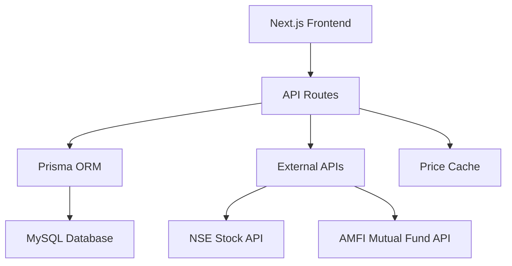

# Design Document

## Overview

The Personal Wealth Management application is a Next.js-based web application that enables users to track investments across multiple asset classes, manage financial goals, and monitor portfolio performance. The application uses a client-side rendering approach with serverless API routes, Prisma ORM for database operations, and integrates with external APIs for real-time pricing data.

## Architecture

### High-Level Architecture



### Technology Stack

- **Frontend**: Next.js 14+ with client-side rendering
- **Backend**: Next.js API routes (serverless functions)
- **Database**: MySQL with Prisma ORM
- **Styling**: Tailwind CSS
- **External APIs**: NSE India (stocks), AMFI India (mutual funds)
- **Caching**: In-memory cache for price data

## Components and Interfaces

### Database Schema (Prisma)

```prisma
// prisma/schema.prisma

generator client {
  provider = "prisma-client-js"
}

datasource db {
  provider = "mysql"
  url      = env("DATABASE_URL")
}

enum InvestmentType {
  STOCK
  MUTUAL_FUND
  GOLD
  JEWELRY
  REAL_ESTATE
  FD
  CRYPTO
  OTHER
}

enum AccountType {
  BROKER
  DEMAT
  BANK
  OTHER
}

model Investment {
  id          String         @id @default(cuid())
  type        InvestmentType
  name        String
  symbol      String?        // For stocks and mutual funds
  units       Float?         // For unit-based investments
  buyPrice    Float?         // Price per unit
  quantity    Float?         // Alias for units, computed field
  totalValue  Float?         // For non-unit investments
  buyDate     DateTime
  goalId      String
  accountId   String
  notes       String?
  createdAt   DateTime       @default(now())
  updatedAt   DateTime       @updatedAt
  
  goal        Goal           @relation(fields: [goalId], references: [id])
  account     Account        @relation(fields: [accountId], references: [id])
  
  @@map("investments")
}

model Goal {
  id           String       @id @default(cuid())
  name         String
  targetAmount Float
  targetDate   DateTime
  priority     Int?         @default(1)
  description  String?
  createdAt    DateTime     @default(now())
  updatedAt    DateTime     @updatedAt
  
  investments  Investment[]
  
  @@map("goals")
}

model Account {
  id          String        @id @default(cuid())
  name        String
  type        AccountType
  notes       String?
  createdAt   DateTime      @default(now())
  updatedAt   DateTime      @updatedAt
  
  investments Investment[]
  
  @@map("accounts")
}

model PriceCache {
  id          String   @id @default(cuid())
  symbol      String   @unique
  price       Float
  lastUpdated DateTime @default(now())
  source      String   // 'NSE' or 'AMFI'
  
  @@map("price_cache")
}
```

### Frontend Components Structure

```
src/
├── components/
│   ├── ui/                     # Reusable UI components
│   │   ├── Button.tsx
│   │   ├── Input.tsx
│   │   ├── Select.tsx
│   │   └── Modal.tsx
│   ├── layout/
│   │   ├── Header.tsx
│   │   ├── Navigation.tsx
│   │   └── Layout.tsx
│   ├── dashboard/
│   │   ├── PortfolioSummary.tsx
│   │   ├── AssetAllocation.tsx
│   │   ├── GoalProgress.tsx
│   │   └── TopPerformers.tsx
│   ├── investments/
│   │   ├── InvestmentForm.tsx
│   │   ├── InvestmentList.tsx
│   │   ├── InvestmentCard.tsx
│   │   └── DynamicFields.tsx
│   ├── goals/
│   │   ├── GoalForm.tsx
│   │   ├── GoalList.tsx
│   │   └── GoalProgress.tsx
│   └── accounts/
│       ├── AccountForm.tsx
│       └── AccountList.tsx
├── pages/
│   ├── index.tsx               # Dashboard
│   ├── investments/
│   │   ├── index.tsx           # Investment list
│   │   └── [id].tsx            # Investment details/edit
│   ├── goals/
│   │   ├── index.tsx           # Goals list
│   │   └── [id].tsx            # Goal details
│   ├── accounts/
│   │   ├── index.tsx           # Accounts list
│   │   └── [id].tsx            # Account details
│   └── api/                    # API routes
├── lib/
│   ├── prisma.ts              # Prisma client
│   ├── validations.ts         # Zod schemas
│   ├── calculations.ts        # Portfolio calculations
│   └── price-fetcher.ts       # Price API utilities
└── types/
    └── index.ts               # TypeScript types
```

### API Routes Structure

```
/api/
├── investments/
│   ├── index.ts               # GET (list), POST (create)
│   └── [id].ts                # GET, PUT, DELETE (by ID)
├── goals/
│   ├── index.ts               # GET (list), POST (create)
│   └── [id].ts                # GET, PUT, DELETE (by ID)
├── accounts/
│   ├── index.ts               # GET (list), POST (create)
│   └── [id].ts                # GET, PUT, DELETE (by ID)
├── prices/
│   ├── stocks.ts              # GET stock prices from NSE
│   └── mutual-funds.ts        # GET mutual fund NAV from AMFI
└── dashboard/
    └── summary.ts             # GET dashboard summary data
```

## Data Models

### Investment Model Logic

The Investment model uses a flexible approach to handle different asset types:

- **Unit-based assets** (stocks, mutual funds): Use `units` and `buyPrice`
- **Total value assets** (real estate, jewelry): Use `totalValue`
- **Computed fields**: `quantity` as an alias for `units` for API consistency

### Price Calculation Logic

```typescript
interface InvestmentWithCurrentValue {
  investment: Investment;
  currentPrice?: number;
  currentValue: number;
  gainLoss: number;
  gainLossPercentage: number;
}

function calculateInvestmentValue(investment: Investment, currentPrice?: number): InvestmentWithCurrentValue {
  let currentValue: number;
  let investedValue: number;
  
  if (investment.units && investment.buyPrice) {
    // Unit-based calculation
    investedValue = investment.units * investment.buyPrice;
    currentValue = currentPrice ? investment.units * currentPrice : investedValue;
  } else if (investment.totalValue) {
    // Total value calculation (no current price for these typically)
    investedValue = investment.totalValue;
    currentValue = investment.totalValue;
  } else {
    throw new Error('Invalid investment data');
  }
  
  const gainLoss = currentValue - investedValue;
  const gainLossPercentage = (gainLoss / investedValue) * 100;
  
  return {
    investment,
    currentPrice,
    currentValue,
    gainLoss,
    gainLossPercentage
  };
}
```

### Dynamic Form Fields

The investment form adapts based on the selected investment type:

```typescript
const getFieldsForInvestmentType = (type: InvestmentType) => {
  const baseFields = ['name', 'buyDate', 'goalId', 'accountId', 'notes'];
  
  switch (type) {
    case 'STOCK':
    case 'MUTUAL_FUND':
      return [...baseFields, 'symbol', 'units', 'buyPrice'];
    case 'REAL_ESTATE':
    case 'JEWELRY':
    case 'GOLD':
      return [...baseFields, 'totalValue'];
    case 'FD':
      return [...baseFields, 'totalValue', 'maturityDate', 'interestRate'];
    case 'CRYPTO':
      return [...baseFields, 'symbol', 'units', 'buyPrice'];
    default:
      return [...baseFields, 'totalValue'];
  }
};
```

## External API Integration

### NSE Stock Price Fetching

```typescript
interface NSEResponse {
  info: {
    symbol: string;
    companyName: string;
    lastPrice: number;
  };
}

async function fetchStockPrice(symbol: string): Promise<number> {
  const response = await fetch(`https://www.nseindia.com/api/quote-equity?symbol=${symbol}`);
  const data: NSEResponse = await response.json();
  return data.info.lastPrice;
}
```

### AMFI Mutual Fund NAV Parsing

```typescript
interface MutualFundNAV {
  schemeCode: string;
  schemeName: string;
  nav: number;
  date: string;
}

async function fetchMutualFundNAV(): Promise<MutualFundNAV[]> {
  const response = await fetch('https://www.amfiindia.com/spages/NAVAll.txt');
  const text = await response.text();
  
  return text
    .split('\n')
    .filter(line => line.includes('|'))
    .map(line => {
      const [schemeCode, , schemeName, nav, date] = line.split('|');
      return {
        schemeCode: schemeCode.trim(),
        schemeName: schemeName.trim(),
        nav: parseFloat(nav.trim()),
        date: date.trim()
      };
    })
    .filter(item => !isNaN(item.nav));
}
```

### Price Caching Strategy

```typescript
class PriceCache {
  private cache = new Map<string, { price: number; timestamp: number }>();
  private readonly CACHE_DURATION = 5 * 60 * 1000; // 5 minutes
  
  async getPrice(symbol: string, source: 'NSE' | 'AMFI'): Promise<number> {
    const cached = this.cache.get(symbol);
    
    if (cached && Date.now() - cached.timestamp < this.CACHE_DURATION) {
      return cached.price;
    }
    
    const price = source === 'NSE' 
      ? await fetchStockPrice(symbol)
      : await this.getMutualFundPrice(symbol);
    
    this.cache.set(symbol, { price, timestamp: Date.now() });
    
    // Also update database cache
    await prisma.priceCache.upsert({
      where: { symbol },
      update: { price, lastUpdated: new Date(), source },
      create: { symbol, price, source }
    });
    
    return price;
  }
}
```

## Error Handling

### API Error Handling

```typescript
// lib/api-handler.ts
export function withErrorHandling(handler: NextApiHandler): NextApiHandler {
  return async (req, res) => {
    try {
      await handler(req, res);
    } catch (error) {
      console.error('API Error:', error);
      
      if (error instanceof Prisma.PrismaClientKnownRequestError) {
        return res.status(400).json({ error: 'Database error', code: error.code });
      }
      
      if (error instanceof z.ZodError) {
        return res.status(400).json({ error: 'Validation error', details: error.errors });
      }
      
      return res.status(500).json({ error: 'Internal server error' });
    }
  };
}
```

### Frontend Error Handling

```typescript
// hooks/useErrorHandler.ts
export function useErrorHandler() {
  const [error, setError] = useState<string | null>(null);
  
  const handleError = (error: unknown) => {
    if (error instanceof Error) {
      setError(error.message);
    } else {
      setError('An unexpected error occurred');
    }
  };
  
  const clearError = () => setError(null);
  
  return { error, handleError, clearError };
}
```

## Testing Strategy

### Unit Testing

- **Models**: Test Prisma model validations and relationships
- **Calculations**: Test portfolio calculation functions
- **API Utilities**: Test price fetching and parsing functions
- **Components**: Test React components with React Testing Library

### Integration Testing

- **API Routes**: Test CRUD operations with test database
- **Price Fetching**: Test external API integration with mocked responses
- **Database Operations**: Test Prisma queries and transactions

### End-to-End Testing

- **User Flows**: Test complete investment management workflows
- **Dashboard**: Test portfolio calculations and display
- **Form Interactions**: Test dynamic form behavior

### Test Structure

```
__tests__/
├── unit/
│   ├── lib/
│   │   ├── calculations.test.ts
│   │   └── price-fetcher.test.ts
│   └── components/
│       ├── InvestmentForm.test.tsx
│       └── Dashboard.test.tsx
├── integration/
│   ├── api/
│   │   ├── investments.test.ts
│   │   └── prices.test.ts
│   └── database/
│       └── prisma.test.ts
└── e2e/
    ├── investment-management.test.ts
    └── dashboard.test.ts
```

## Performance Considerations

### Database Optimization

- Index frequently queried fields (goalId, accountId, type)
- Use database-level aggregations for portfolio calculations
- Implement pagination for large investment lists

### Caching Strategy

- In-memory cache for frequently accessed price data
- Database cache for persistent price storage
- Client-side caching for static data (goals, accounts)

### API Optimization

- Batch price fetching requests
- Implement rate limiting for external API calls
- Use connection pooling for database connections

## Security Considerations

### Data Validation

- Use Zod schemas for input validation
- Sanitize user inputs
- Validate file uploads (if implemented)

### API Security

- Implement rate limiting
- Add CORS configuration
- Use environment variables for sensitive data
- Validate request origins

### Database Security

- Use parameterized queries (Prisma handles this)
- Implement proper error handling to avoid data leaks
- Regular database backups